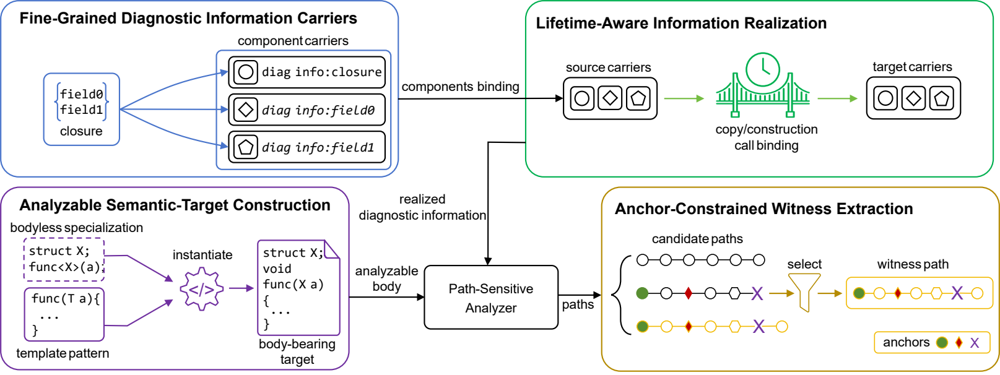

# Boundary-Aware Diagnostic Information Preservation for C++ Path-Sensitive Static Analysis

## Overview

Path-sensitive static analysis must maintain the relationships among allocation, propagation, release, and subsequent access events along feasible execution paths. Modern C++ features, including object encapsulation, construction and call transitions, template instantiation, and definitions from separate translation units, can expose the same source-level value through different symbolic representations and analysis contexts. When the semantic relationship between these representations does not survive across analysis stages, diagnostic information discontinuity can arise, leading to missed defects, inaccurate lifecycle reasoning, or diagnostic paths that omit essential evidence. This archive provides the implementation files and controlled experimental artifacts associated with the paper.



## Archive Layout

- `clang/`: implementation files that overlay an LLVM/Clang 15.0.4 source tree.
- `suite_export/`: reproduction programs, build files, the analysis script, and report aggregation utilities.

## Experimental Environment

| Component | Version or configuration |
| --- | --- |
| Operating system | Ubuntu 20.04 x86_64 |
| LLVM/Clang | 15.0.4 |
| Python | 3.9 in a Conda environment |
| Bear | 2.4.3 |
| CodeChecker | 6.26.2 |
| Build configuration | C++17, GNU Make, CMake, and Ninja |

Run all commands below in Bash on Ubuntu 20.04.

## 1. Install System Dependencies

The Ubuntu 20.04 package repository provides Bear 2.4.3. Install the build tools and the pinned Bear package:

```bash
sudo apt-get update
sudo apt-get install -y \
  build-essential \
  git \
  cmake \
  ninja-build \
  make \
  wget \
  bzip2 \
  bear=2.4.3-1
```

The analysis script uses the Bear 2.4.3 command form `bear make`. Bear 3.x and later generally use `bear -- make`; do not mix the two forms without updating the script accordingly.

## 2. Install Python 3.9 and CodeChecker

Install Miniconda and create a Python 3.9 environment named `OHOS`:

```bash
wget -O Miniconda3-latest-Linux-x86_64.sh \
  https://repo.anaconda.com/miniconda/Miniconda3-latest-Linux-x86_64.sh
bash Miniconda3-latest-Linux-x86_64.sh -b -p "$HOME/miniconda3"
source "$HOME/miniconda3/etc/profile.d/conda.sh"

conda create -n OHOS python=3.9 -y
conda activate OHOS

python -m pip install --upgrade pip
python -m pip install "codechecker==6.26.2" pandas tqdm
```

For later terminal sessions, initialize Conda and activate the environment before running the analysis:

```bash
source "$HOME/miniconda3/etc/profile.d/conda.sh"
conda activate OHOS
```

## 3. Build LLVM/Clang 15.0.4

Open a terminal in the `Paper1_submitted` root directory. Define three absolute paths and replace every `/absolute/path/to/...` placeholder before running the commands. `LLVM_ROOT` points to the LLVM source tree, `LLVM_BUILD` points to the build directory, and `LLVM_INSTALL` is the installation prefix:

```bash
export LLVM_ROOT=/absolute/path/to/llvm-project
export LLVM_BUILD=/absolute/path/to/llvm-build
export LLVM_INSTALL=/absolute/path/to/installed-llvm
```

Check out LLVM/Clang 15.0.4:

```bash
git clone --depth 1 --branch llvmorg-15.0.4 \
  https://github.com/llvm/llvm-project.git "$LLVM_ROOT"
```

Overlay the implementation files from this archive onto the official Clang source tree. The trailing `/.` copies the contents of `clang/` without creating another nested directory:

```bash
cp -a "./clang/." "$LLVM_ROOT/clang/"
```

Configure LLVM with the project and target sets used in the experiment, then build and install the toolchain:

```bash
cmake -S "$LLVM_ROOT/llvm" -B "$LLVM_BUILD" -G Ninja \
  -DCMAKE_BUILD_TYPE=Release \
  -DLLVM_ENABLE_PROJECTS="clang;clang-tools-extra;lld;lldb;openmp" \
  -DCMAKE_INSTALL_PREFIX="$LLVM_INSTALL" \
  -DLLVM_TARGETS_TO_BUILD="X86;ARM;AArch64;BPF"

cmake --build "$LLVM_BUILD" -j"$(nproc)"
cmake --install "$LLVM_BUILD"
```

## 4. Set the Default Clang Toolchain

Add the installed tools to the current user's `PATH` so that CodeChecker can locate `clang`, `clang++`, and `clang-extdef-mapping`:

```bash
export PATH="$LLVM_INSTALL/bin:$PATH"
echo "export PATH=\"$LLVM_INSTALL/bin:\$PATH\"" >> "$HOME/.bashrc"
```

Set the installed `clang` and `clang++` as the system defaults:

```bash
sudo update-alternatives --install /usr/bin/clang clang \
  "$LLVM_INSTALL/bin/clang" 150
sudo update-alternatives --install /usr/bin/clang++ clang++ \
  "$LLVM_INSTALL/bin/clang++" 150

sudo update-alternatives --set clang "$LLVM_INSTALL/bin/clang"
sudo update-alternatives --set clang++ "$LLVM_INSTALL/bin/clang++"
```

Verify the selected executables and versions:

```bash
which clang clang++ clang-extdef-mapping bear CodeChecker
clang --version
clang++ --version
python --version
bear --version
CodeChecker version
```

Clang should report `15.0.4`, Python should report `3.9.x`, Bear should report `2.4.3`, and CodeChecker should report `6.26.2`.

## 5. Run the Analysis

Enter the controlled experiment directory and run the full analysis pipeline:

```bash
source "$HOME/miniconda3/etc/profile.d/conda.sh"
conda activate OHOS
cd ./suite_export
chmod +x run_analysis.sh
./run_analysis.sh
```

`run_analysis.sh` removes previous analysis output, regenerates the compilation database, runs CodeChecker CTU analysis, renders the HTML reports, and aggregates the plist results.

## Output Files

- `compile_commands.json`: the compilation database captured by Bear.
- `reports/`: plist reports and metadata generated by CodeChecker.
- `html_out/`: browsable HTML reports generated by CodeChecker.
- `summary_report.html`: the result summary generated by the aggregation script.
